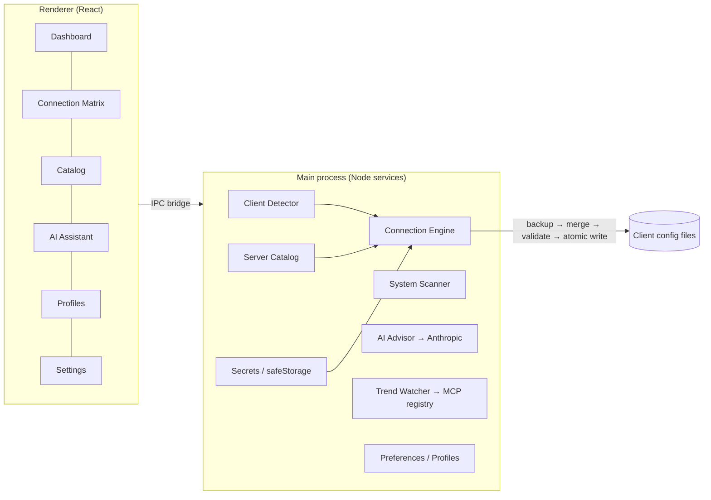

# 🦀 MCP Command Center

**One graphical, AI‑assisted control plane for connecting every AI client and every MCP server on your machine.**

MCP Command Center detects the MCP‑capable AI tools you already have (Claude Desktop,
Claude Code, Cursor, VS Code, Windsurf, Continue, Zed), shows them in a single
**connection matrix**, and lets you wire up [Model Context Protocol](https://modelcontextprotocol.io)
servers with one click — safely writing each client's real config file for you. It also
recommends connections with AI, scans your system for opportunities, and keeps an eye out
for newly published MCP servers worth adding.

> Cross‑platform desktop app (Windows + macOS + Linux), built with Electron + React.

---

## ✨ What it does

| Pillar | What you get |
|---|---|
| **Detect** | Finds installed MCP clients and reads their current server wiring across OS‑specific config locations. |
| **Connect** | A clients × servers matrix. Click a cell to connect/disconnect; review a diff; apply. Every write is backed up first. |
| **Catalog** | A searchable library of MCP servers from a bundled curated registry, the official MCP registry, and live discovery. |
| **AI Assistant** | Describe a goal in plain English (“automate my email + calendar”) → Claude recommends a bundle → you review the diff before anything changes. |
| **Scan** | Inspects your system (git, gh, docker, psql…) and proposes sensible default connections. |
| **Trends** | Pulls newly published servers from the official MCP registry and surfaces “New & Relevant” cards. |
| **Profiles** | Save reusable bundles (e.g. *Dev stack* = git + github + context7) and apply them across clients in one shot. |

### Safety first
Every config write is **backed up (timestamped), merged (your other settings are preserved),
validated, and written atomically**, with one‑click **restore** and automatic rollback on
failure. Secrets (API tokens, the Anthropic key) are stored encrypted in your OS keychain via
Electron `safeStorage` — never in plaintext configs.

---

## 🚀 Install

### From a release (recommended)
Download the latest installer for your OS from the
[Releases page](https://github.com/sasha-thecornerspore-dev/mcp-command-center/releases):

- **Windows** — `MCP Command Center Setup x.y.z.exe` (installer) or the portable `.exe`
- **macOS** — `MCP Command Center-x.y.z.dmg` (Apple Silicon + Intel)
- **Linux** — `MCP Command Center-x.y.z.AppImage`

### From source

```bash
git clone https://github.com/sasha-thecornerspore-dev/mcp-command-center.git
cd mcp-command-center
npm install
npm run dev      # launch in development
```

Build installers locally:

```bash
npm run dist:win    # Windows (nsis + portable)
npm run dist:mac    # macOS (dmg + zip)
npm run dist        # current platform
```

---

## 🧭 Quick start

1. Launch the app — it auto‑detects your installed clients on the **Dashboard**.
2. (Optional) Open **Settings** and paste your **Anthropic API key** to enable AI recommendations.
3. Click **Scan system** for suggested defaults, or **Check for new MCPs** to pull the latest from the official registry.
4. Open the **Connection Matrix**, click cells to stage connections, then **Review & apply**.
5. Save a **Profile** for any bundle you'll reuse.

---

## 🏗️ Architecture



- **Client Detector** — locates each client's config and parses current servers.
- **Connection Engine** — the only writer; backup → merge → validate → atomic write → restore.
- **Server Catalog** — normalizes servers from bundled / official‑registry / web / scanner sources.
- **AI Advisor** — turns NL goals into reviewable connection plans (Anthropic).
- **System Scanner / Trend Watcher** — suggested defaults and “new & relevant” discovery.

See [`docs/superpowers/specs`](docs/superpowers/specs) for the full design.

---

## 🧩 Supported clients

| Client | Config managed |
|---|---|
| Claude Desktop | `…/Claude/claude_desktop_config.json` |
| Claude Code | `~/.claude.json` |
| Cursor | `~/.cursor/mcp.json` |
| VS Code | `…/Code/User/mcp.json` |
| Windsurf | `~/.codeium/windsurf/mcp_config.json` |
| Continue | `~/.continue/config.json` |
| Zed | `…/Zed/settings.json` |

The catalog and client list are data‑driven — adding more is a small change in
`resources/registry/servers.json` and `src/main/services/paths.ts`.

---

## 🛠️ Development

```bash
npm run dev         # hot-reloading dev app
npm test            # unit tests (Vitest) — adapters + connection engine
npm run typecheck   # strict TypeScript across main + renderer
npm run build       # production bundle (electron-vite)
```

Stack: **Electron · electron‑vite · React · TypeScript · Tailwind CSS · Vitest · electron‑builder.**

---

## 🤝 Contributing

PRs welcome — see [CONTRIBUTING.md](CONTRIBUTING.md). Good first contributions:
add a client adapter, expand the bundled registry, or improve the system scanner probes.

## 📜 License

[MIT](LICENSE) © 2026 OpenClaw Community
